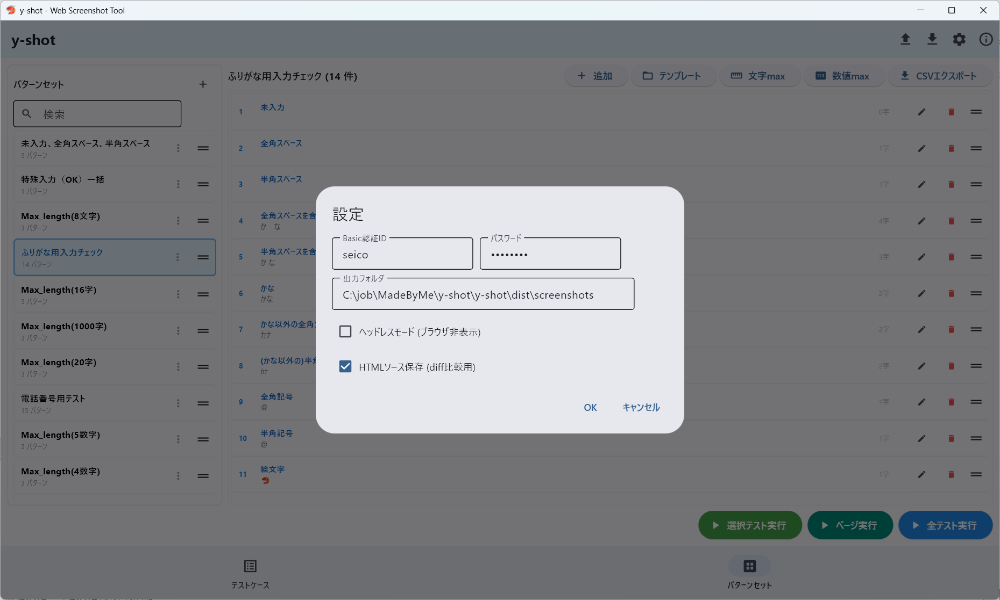
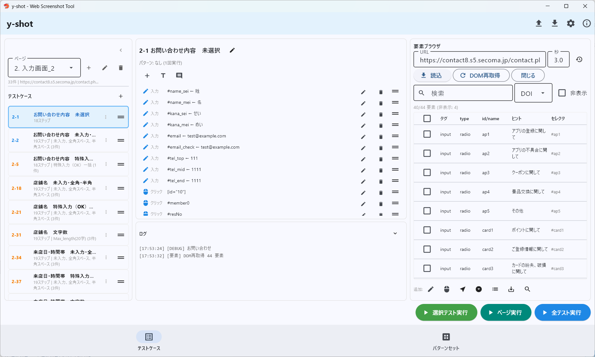
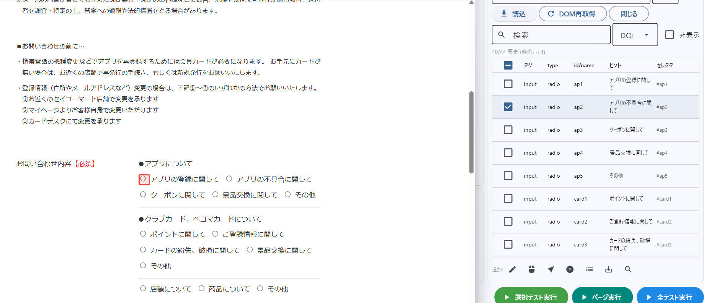
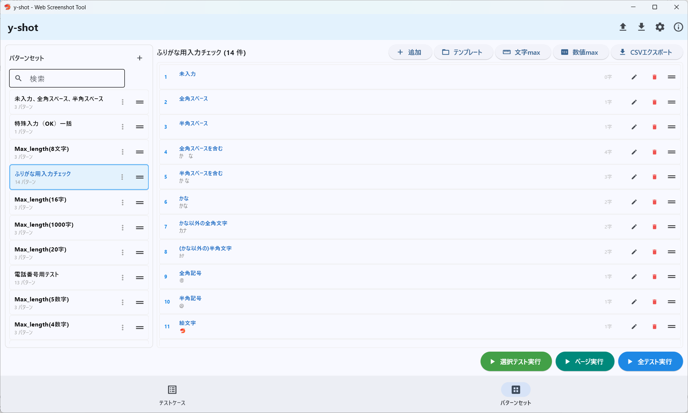

# y-shot 操作マニュアル

**Web Screenshot Automation Tool**
対象: 社内作業者向け / バージョン: 2.1

---

> **テストケースの保存について**
> ソフトウェアの改修が見込まれますが、テストケースさえ保存しておけば撮り直しが可能です。
> プロジェクトエクスポート（AppBarの ↑ アイコン）で `.yshot.json` として書き出しておいてください。

---

## 1. 初期設定

AppBar右上の **歯車アイコン** をクリックして設定ダイアログを開きます。



| 項目 | 説明 |
|------|------|
| **Basic認証ID / パスワード** | 開発環境などBasic認証が必要なサイトで設定 |
| **出力フォルダ** | スクリーンショットの保存先 |
| **ヘッドレスモード** | ONにするとブラウザを表示せずに実行（高速） |
| **HTMLソース保存** | ONにするとスクショと一緒にHTMLソースを保存（diff比較用） |

---

## 2. ページを作成する

画面左上のページドロップダウンの横にある **＋ボタン** でページを追加します。

- **ページ名**: テスト対象の画面名（例: 「お問い合わせ入力画面」）
- **起点URL**: そのページのURL
- **ページ番号**: テストケースの採番に使用（例: ページ番号「2」→ テスト番号「2-1, 2-2, ...」）
- **テスト開始番号**: 枝番の開始値（通常は1）

---

## 3. テストケースを作成する

「テストケース」欄の **＋ボタン** でテストケースを追加します。



テストケースをクリックして選択すると、中央にステップ一覧が表示されます。

### テストケース設定（鉛筆アイコン）

- **テスト名**: わかりやすい名前をつける
- **パターンセット**: データ駆動テストを行う場合に指定（後述）
- **ページ**: 所属するページの変更
- **開始URL**: ページURLと異なるURLから開始する場合のみ

---

## 4. 要素ブラウザでステップを記述する

画面右側の **要素ブラウザ** でテスト対象ページの要素を確認し、ステップを組み立てます。

### 4-1. ページを読み込む

1. URL欄にテスト対象のURLを入力（ページ切替で自動入力されます）
2. **読込** ボタンをクリック
3. Chromeが起動し、ページの全要素が一覧表示されます



### 4-2. 要素を選択してステップ追加

一覧から要素をクリックすると、ブラウザ上でハイライトされます。
下部のアイコンでステップを追加します:

| アイコン | 機能 | 用途 |
|---------|------|------|
| 📝 | **入力** | テキストフィールドに値を入力 |
| 🖱 | **クリック** | ボタン・リンク・チェックボックスをクリック |
| ↗ | **ホバー** | マウスホバー（メニュー展開等） |
| ⏬ | **選択** | セレクトボックスの値を選択 |
| 📋 | **全パターン** | select/radioの全選択肢を自動パターン化 |
| 💾 | **値取込** | 現在のフォーム入力値を一括取込 |
| 🔍 | **セレクタテスト** | CSSセレクタの動作確認 |
| ℹ️ | **要素詳細** | 選択要素の全属性を表示 |

### 4-3. よく使うステップの組み方

**基本的なフォーム入力テスト:**
```
1. 入力: #name ← テスト太郎
2. 入力: #email ← test@example.com
3. クリック: input[type="submit"]
4. スクショ: 表示範囲
```

**ページ遷移を含むテスト:**
```
1. 入力: #name ← テスト太郎
2. クリック: .submit-btn
3. 待機: 2秒
4. スクショ: 表示範囲        ← 確認画面
5. クリック: .confirm-btn
6. 待機: 2秒
7. スクショ: 表示範囲        ← 完了画面
```

### 4-4. ステップの手動追加・編集

中央の **＋ボタン** からステップを手動追加することもできます。
各ステップの鉛筆アイコンで編集、ゴミ箱アイコンで削除できます。

**ステップの種類一覧:**

| 種類 | 説明 |
|------|------|
| 入力 | テキストフィールドに値を入力。入力モード: 上書き/追記/クリアのみ |
| クリック | 要素をクリック |
| ホバー | 要素にマウスオーバー（ホバーメニュー展開用） |
| 選択 | セレクトボックスの値を選択 |
| 待機 | 指定秒数待つ |
| 要素待機 | 指定要素が表示されるまで待つ（最大N秒） |
| スクロール | 要素へスクロール / ピクセル指定 / 先頭に戻る |
| スクショ | スクリーンショット撮影。モード: 表示範囲/ページ全体/要素のみ/要素+余白 |
| 戻る | ブラウザバック |
| ナビゲーション | 指定URLに遷移 |
| 見出し | ステップのセクション分け（折りたたみ可能） |
| コメント | メモ（実行時はスキップ） |

---

## 5. テストを実行する

画面下部のボタンで実行します。

| ボタン | 動作 |
|--------|------|
| **選択テスト実行** | 選択中の1テストケースのみ実行 |
| **ページ実行** | 現在のページのテストケースをすべて実行 |
| **全テスト実行** | 全ページの全テストケースを実行 |

実行中はプログレスバーで進捗が表示されます。**中断** ボタンで途中停止可能です。

完了後、**出力フォルダを開く** ボタンで結果を確認できます。
- スクリーンショット（PNG）
- HTMLレポート（`report.html`）
- Excelレポート（`evidence.xlsx`）

---

## 6. パターンセットの活用

同じ操作を異なるデータで繰り返す場合、パターンセットを使います。



下部ナビゲーションの **パターンセット** タブで管理します。

### パターンセットの作成

1. ＋ボタンで新規作成
2. パターンを追加（ラベル + 入力値）
3. テストケース設定でパターンセットを紐付け

### 便利機能

- **テンプレート**: CSV形式のテンプレートからインポート
- **文字max**: max_lengthの境界値パターンを自動生成（max-1, max, max+1）
- **数値max**: 半角数値版の境界値パターンを自動生成
- **CSVエクスポート**: パターンをCSVとして書き出し

### 値の指定方法（ステップ編集時）

ステップの値指定は2段階です:

1. **手入力** or **パターン** を選択
2. パターンを選んだ場合 → どのパターンセットかを選択

※ 1テストケースにつきパターンセットは1つまでです。

---

## 付録A: ワイン検索のテスト方法

ワイン検索ページ（セイコーマート）はホバーメニューで検索条件が表示される特殊なUIです。

### テストケースの組み方

```
1. ホバー: a.js-menu-trigger          ← メニューをホバーで開く
2. 待機: 1秒
3. クリック: input[type="checkbox"][name="type[]"][value="1"]  ← 赤ワイン
4. クリック: input[type="checkbox"][name="type[]"][value="2"]  ← 白ワイン
5. クリック: input[type="submit"]      ← 検索実行
6. 待機: 2秒
7. スクショ: 表示範囲
```

### ポイント

- **ホバーステップ** を使ってメニューを開く（クリックではなくホバーで開くメニュー）
- チェックボックスは `name` と `value` の組み合わせで一意に指定
- 要素ブラウザで **非表示** チェックをONにすると、メニュー内の隠れた要素も表示されます
- 要素の **ℹ️ 詳細** ボタンで全属性を確認できます

---

## 付録B: ログイン必須サイトのテスト方法（アルバイト管理バックエンド等）

ログインが必要なサイトでは、要素ブラウザのChromeウィンドウ上で手動ログインできます。

### 手順

1. 要素ブラウザでログインページのURLを読み込む
2. 表示されたChromeウィンドウで **手動ログイン** する
3. ログイン後、Chrome上で目的のページに **手動で移動** する
4. y-shotに戻って **DOM再取得** をクリック → 現在のページの要素が取得される

### テストケースでの自動ログイン

テスト実行時のログインはステップで自動化できます:

```
1. 入力: #username ← admin
2. 入力: #password ← ********
3. クリック: input[type="submit"]
4. 待機: 3秒
5. ナビゲーション: https://example.com/admin/dashboard
6. スクショ: 表示範囲
```

---

## キーボードショートカット

| ショートカット | 動作 |
|--------------|------|
| Ctrl + S | 保存 |
| Ctrl + N | テストケース追加（TC画面）/ パターンセット追加（PS画面） |
| Delete | 選択中のテストケース / パターンセットを削除 |

---

## プロジェクトの保存と復元

- **エクスポート**: AppBarの ↑ アイコン → `.yshot.json` として保存
- **インポート**: AppBarの ↓ アイコン → ファイルを選択して復元
- インポート方法: **置換**（上書き）または **マージ**（追加）

---

*y-shot v2.1 / Developed by Yuri Norimatsu*
